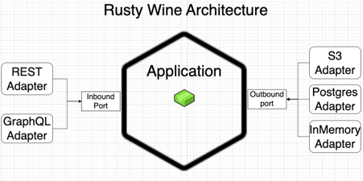

# Rusty Wine
rusty-wine is a sample Rust project showcasing a simple wine inventory system using the Hexagonal Architecture.

## Architecture
The architecture of rusty-wine follows the Hexagonal Architecture pattern (Ports & Adapters):



- Inbound: handles incoming requests and responses (REST and GraphQL).
- Application: implements the business logic of the system, using services and entities.
- Outbound: manages the persistence of data to a data store.

## Technologies
- Rust: a systems programming language that provides speed, memory safety, and parallelism, making it ideal for building web applications that require high performance and low resource consumption.
- Docker: a platform for developing, shipping, and running applications.
- Actix-web: a powerful web framework built in Rust that is fast, flexible, and easy to use.
- Async-graphql: a Rust-based GraphQL implementation that uses asynchronous programming to provide high performance and low resource consumption.
- Diesel: a Rust-based ORM (Object-Relational Mapping) that makes it easy to interact with databases from Rust applications.
- PostgreSQL: a popular open-source relational database management system that provides powerful features for managing large datasets.

## Getting Started
To get started with rusty-wine, you'll need to [install Rust](https://www.rust-lang.org/tools/install) in order to run the project and [Docker](https://docs.docker.com/get-docker/) to run the database.

- Clone the repository: ```git clone https://github.com/onero/rusty-wine.git```
- Run ```docker-compose up -d``` to start the database (as a background process)
- Install Diesel CLI: ```cargo install diesel_cli --no-default-features --features postgres```
- Create the database: ```diesel setup```
- Run the migrations: ```diesel migration run``` (or ```diesel migration redo``` to reset the database)
- Start the server: ```make watch```

This will start the application on http://localhost:7878. 
You can use a REST client or a GraphQL client to interact with the application endpoints.

## Usage
### RESTful API
The RESTful API allows you to manage the wine inventory. The following endpoints are available:

`GET /wines`: Get a list of all wines in the inventory.

`GET /wines/{id}`: Get a specific wine by ID.

`POST /wines`: Add a new wine to the inventory.

`DELETE /wines/{id}`: Remove a wine from the inventory by ID.

### GraphQL API
The GraphQL API allows you to query and mutate the wine inventory. The following queries and mutations are available:

GraphiQL is available at http://localhost:7878/graphql.

`query {
getWines {
id,
name,
description,
year,
price
}
}`: Get a list of all wines in the inventory.

`query { wine(id: 1) { id,
name,
description,
year,
price 
} 
}`: Get a specific wine by ID.

`mutation { 
addWine(name: "Barolo", year: 2012) 
{ 
id,
name,
description,
year,
price
} 
}`: Add a new wine to the inventory.

`mutation { 
removeWine(id: 1) 
{ 
id,
name,
description,
year,
price 
} 
}`: Remove a wine from the inventory by ID.

## Tests
This project contains unit tests for the application and integration tests for the RESTful API.

To run the tests in watch-mode, use the following command:

```make watch-test```

## Contributing
Contributions to this project are welcome. Please create a pull request with your changes.